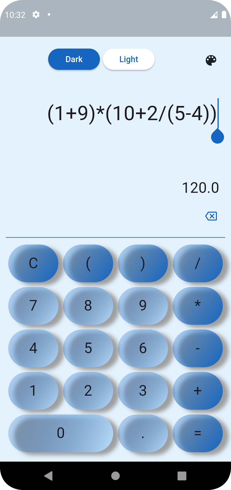

                                          -------    📱 Calculator App (Postfix Method)   -------

A modern and minimal calculator built with **Flutter**, using the **Postfix expression (Reverse Polish Notation)** algorithm for accurate and efficient expression evaluation

## ✨ Features----------------------------------------------------------------

- 🔢 Basic arithmetic operations (➕ ➖ ✖️ ➗)
- 🧠 Postfix Expression Evaluation (Reverse Polish Notation (RPN) )
- 💡 Error Handling
- 🎨 Multi-Color Themes
- 🌗 Theme Support (Optional)
- ⚡ Fast, and responsive
- ⚙️ Custom Expression Input
- 📱 Built for Android & iOS

## 📸 Screenshots----------------------------------------------------------------

{width=100px}{height=300px}

